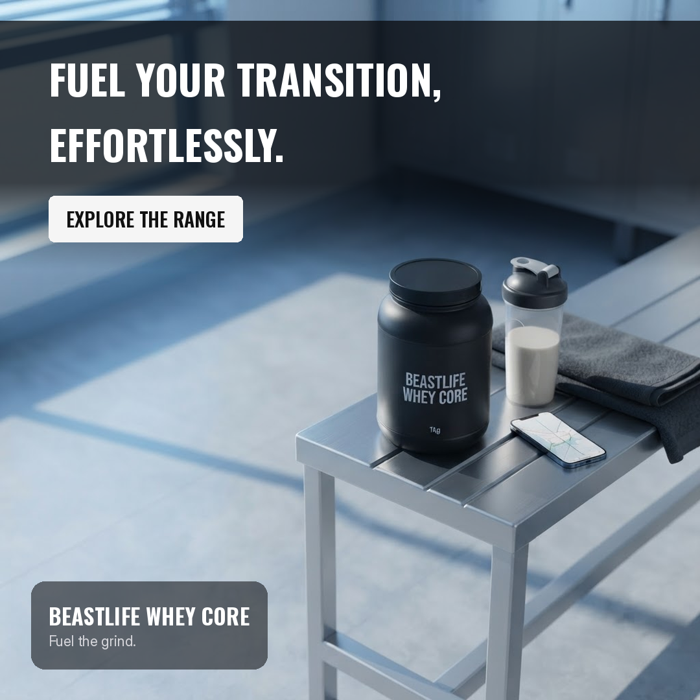

<div align="center">

# 🎬 AI Campaign Creative Studio

**One product brief in. A researched campaign out — two image ads and a video that actually match.**


</div>

---

## What it is

You describe a product. A research agent goes out and reads real pages — not its own memory — and comes back with three creative angles, each cited. You pick one. From that single choice the app writes one creative specification, and every asset after it is generated from that one spec: a square ad, a vertical ad, and an eight-second video.

That last part is the whole point. Two text-to-image calls give you two unrelated pictures. Here one master scene is generated, then handed back to the model to be reframed, so the product, the lighting and the props survive the format change. The headline is never drawn by the image model at all — Pillow renders it, so the copy on the video is the same code, the same font and the same spelling as the copy on the ads.

Every stage writes its state to disk before the next one starts. Kill the backend mid-render and completed work is still there when it comes back up.

## Highlights

- 🔍 **Grounded research** — a bounded agent with three actions, real sources, recorded tool calls and access times
- 🚫 **No invented statistics** — every number in the copy is checked against the retrieved pages and flagged if it is not there
- 🎨 **One spec, every asset** — master scene → reframed per format, so the formats cannot drift apart
- ✍️ **Deterministic type** — Pillow draws the copy, so the headline is exactly what was approved
- 🎞️ **Video from the approved scene** — three rendered frames, animated by FFmpeg, no second generation
- 💾 **Crash-safe** — state persists per stage; a restart marks orphaned work and retry never redoes what succeeded
- 🔒 **Untrusted pages stay untrusted** — the agent's only possible outputs are three whitelisted actions

## A look inside

<div align="center">

**The same campaign in both formats — a reframe, not a regeneration**

 

**The master scene both formats were derived from**


</div>

The eight-second video is committed too: [`sample-campaign/campaign.mp4`](sample-campaign/campaign.mp4), alongside the full run record in [`campaign.json`](sample-campaign/campaign.json) — research trace, sources, spec, prompts and cost.

## The flow

```
Product brief → Research agent → 3 creative angles → User selects 1
              → Shared creative spec → 2 image formats + 1 video
```

**In one sentence:** a pipeline with saved state between every stage, so any stage
can fail, be retried, or survive a restart without losing the work that already
succeeded.

## Built with

Python 3.14 · FastAPI · Pydantic · SQLite · Pillow · FFmpeg · React · Vite

Seven backend dependencies, two on the frontend. No agent framework, no task queue, no ORM — [and here is why](#decisions).

<sub>Built for the Beast Life AI & Engineering assignment. Everything below is the engineering record: how to run it, how it is built, what was decided, and what is not finished.</sub>

---

## Run and verify

### Requirements

- Python 3.11+ (developed on 3.14)
- Node 18+ (developed on 22)
- FFmpeg on `PATH` — `brew install ffmpeg` / `apt install ffmpeg`

### Setup

```bash
git clone <repo-url>
cd "AI Campaign Creative Studio"

cp .env.example .env     # then edit .env and add your two keys
```

`.env` needs:

| Variable | What for | Where to get one |
|---|---|---|
| `OPENROUTER_API_KEY` | Research agent (text) **and** image generation | https://openrouter.ai/keys |
| `TAVILY_API_KEY` | Web search for the research agent | https://tavily.com (free tier) |

Everything else in `.env.example` has a working default.

### Start the backend

```bash
cd backend
./run.sh                 # creates the venv, installs deps, serves on :8000
```

`run.sh` unsets `PYTHONPATH` before starting: a stray `PYTHONPATH` pointing at
another project shadows the venv and produces import errors that look like a
broken install.

### Start the frontend

```bash
cd frontend
npm install
npm run dev              # http://localhost:5173
```

### A finished campaign, without running anything

[`sample-campaign/`](sample-campaign/) holds one complete campaign generated
against live providers: both image exports, the video, the master scene both
images were edited from, and [`campaign.json`](sample-campaign/campaign.json)
with the full agent trace, every source with its access timestamp, all three
angles, the creative spec, and the real per-stage cost.

Read that first if you want to see the output without setting anything up.

### Fixture mode — run it with no API keys

```bash
cd backend
FIXTURE_MODE=1 ./run.sh
```

Every provider call is replaced with canned data. The full pipeline runs end to
end, costs nothing, and makes no network requests — orchestration, persistence,
retry, cropping and the text overlays all execute for real. The generated
*photographs* are placeholders, since there is no image model to call; see
[`sample-campaign/`](sample-campaign/) for what the same code produces live. The UI displays a **FIXTURE
MODE** banner whenever this is on, and fixture research is never presented as
live browsing.

**One thing to expect here.** The video stage may fail its first attempt in
fixture mode with `StageTimeout: the 'video' stage exceeded its 180s limit`.
**Click Retry on that stage — it then succeeds in about 11 seconds.**

This is an artefact of fixture mode, not of the video pipeline. With no network
calls, research, spec and images all complete within the same second, so FFmpeg
starts while Pillow is still writing four full-size PNGs and the two contend for
the same cores. Against live providers the stages are separated by network waits
and the same render takes 11s (measured; FFmpeg alone is ~9s). The bound is
doing its job — it stops a stage that is genuinely over its limit — and the
retry path is the intended recovery, so this is left as-is and documented rather
than papered over by raising the timeout only for fixture runs.

### Tests

```bash
cd backend
./run_tests.sh           # 28 tests, ~3s, no network calls
```

Covers the three areas the assignment names — input/schema validation, one
failure-and-retry path, and reuse of successful stage outputs — plus the agent
safety checks.

### Verify one complete campaign

```bash
python3 verify_campaign.py
```

Checks the committed sample campaign against the acceptance criteria and prints
one line per check. No keys, no network, no backend, no dependencies beyond the
standard library — a reviewer can run it immediately after cloning. Exit code is
0 only if every check passes.

```
  PASS  source links: at least 3 pages cited            9 source URLs (minimum 3)
  PASS  image_1x1: exactly 1080x1080                    1080x1080
  PASS  image_9x16: exactly 1080x1920                   1080x1920
  PASS  video: 6-10 seconds                             8.00s
  PASS  video: exactly 1080x1920                        1080x1920
  ...
  All 16 checks passed (1 skipped)
```

To verify a campaign generated on this machine — including that it survives a
restart — start the backend, run a campaign, restart the backend, then:

```bash
python3 verify_campaign.py --api http://localhost:8000 --campaign <campaign-id>
```

That form downloads every asset back through the HTTP API rather than reading
files off disk, so it verifies the artifacts are genuinely downloadable, and it
runs the history check that the offline form skips.

### Reproduce a failure and a retry

```bash
cd backend
./run_tests.sh -k test_failed_stage_is_recorded_then_succeeds_on_retry -v
```

This patches the research agent to raise, asserts the failure is **persisted**
with `attempts == 1`, restores the agent, retries, and asserts `attempts == 2`
with the error cleared.

To see it against the running app: start a campaign, then kill the backend while
a stage is running and restart it. Startup prints
`[startup] marked N interrupted stage(s) from a previous run`, the interrupted
stage shows a **Retry** button, and every completed stage stays `succeeded`.

---

## Architecture

### Workflow

```
┌───────────┐   ┌──────────┐   ┌────────────┐   ┌────────┐   ┌───────┐
│  Brief    │──▶│ Research │──▶│  [HUMAN]   │──▶│  Spec  │──▶│Images │──┐
│ validated │   │  agent   │   │ picks 1/3  │   │        │   │ 1:1   │  │
└───────────┘   └──────────┘   └────────────┘   └────────┘   │ 9:16  │  │
                                                             └───────┘  │
                                                             ┌───────┐  │
                                                             │ Video │◀─┘
                                                             └───────┘
```

Each box is a row in the `stages` table with a status:
`pending → running → succeeded | failed | interrupted`.

**What must wait:** `spec` waits on a *human decision*, not just data. `images`
waits on the spec. `video` waits on the rendered 9:16 image.

**What could run concurrently:** the 1:1 and 9:16 edits are independent — both
derive from the same master. They are run sequentially anyway, because two
simultaneous image requests risk provider rate limits and the ~30s saving does
not justify the extra failure modes.

### Stage contracts

Defined as Pydantic models in [`backend/app/models.py`](backend/app/models.py) —
read that file top to bottom to understand the whole app.

| Stage | Input | Output |
|---|---|---|
| research | `ProductBrief` | `ResearchOutput` — 3 `CreativeAngle`, `Source[]`, `ToolCall[]` |
| spec | `ProductBrief` + selected `CreativeAngle` | `CreativeSpec` |
| images | `CreativeSpec` | `Asset[]` — master, 1080×1080, 1080×1920 |
| video | `CreativeSpec` + 9:16 asset | `Asset` — 1080×1920 MP4 |

Invalid input is rejected at the HTTP boundary with a 422 and never reaches the
database or a provider.

### Data model

```
campaigns   id, product_name, brief_json, selected_angle, spec_json, timestamps
stages      campaign_id, name, status, output_json, error, attempts, timestamps
assets      asset_id, campaign_id, kind, asset_json
usage       campaign_id, usage_json
```

SQLite via the stdlib `sqlite3` module, WAL mode enabled so the API can read
status while the worker writes results.

### Agent tools

The research agent has exactly two:

| Tool | Purpose |
|---|---|
| `web_search(query)` | Tavily search — titles, URLs, snippets |
| `fetch_page(url)` | Read one page in depth |

Plus `finish()`. `_ALLOWED_ACTIONS` is a hard whitelist: the model can emit
nothing else.

**Bounds** (all configurable in `.env`): 5 searches, 5 page reads, 6 total steps,
180s per stage, 2 provider retries.

### Recovery and retry

- A stage can only be `running` while a worker holds it in memory, and memory
  dies with the process. Any stage still `running` at startup is therefore
  abandoned, and the startup sweep marks it `interrupted`.
- `run_stage` skips stages that already succeeded, so retrying a late stage never
  redoes an early one.
- `claim_stage` is a single atomic `UPDATE ... WHERE status != 'running'`, which
  is what rejects a double-submitted stage.

---

## Creative approach

### How research informed the angle

The agent decides its own searches, reads promising pages in depth, and stops
when it has enough. Every angle separates **`audience_insight`** (must trace to
a retrieved source, cited in `source_urls`) from **`hook`** and
**`visual_direction`** (openly labelled as creative interpretation).

Two guards on top:
- Citations naming URLs the agent never retrieved are **dropped**.
- Statistics that appear in no retrieved source are **flagged** on the angle card
  as `unsupported_numbers`, visible to the reviewer before approval. This exists
  because live testing caught the model emitting confident figures — `25.6%`,
  `6:30 a.m.`, `62%` — that were in none of its sources.

### How both images stay consistent

Not two text-to-image prompts. The chain is:

1. **One master scene** is generated from the spec.
2. That master is sent **back into the image model as an input image**, with
   instructions to recompose it for each aspect ratio. This is *editing*, so the
   1:1 and 9:16 exports derive from the master's pixels.
3. Each result is **cover-cropped** (never stretched) to exactly 1080×1080 and
   1080×1920.
4. Headline, body copy, and CTA are **burned on with Pillow**, so the copy is
   always exactly what was approved.

The `CreativeSpec` is the same mechanism at the data level: palette, product
identity, and copy exist in one place, so they cannot drift between formats.

Text is kept out of the image prompts deliberately — a sanitiser strips phrases
like "typography", "branding", and the brand name itself from every field that
reaches the model, because image models render letterforms badly.

### Why there are no people in the creatives

Every generated scene is product-only — the tub, a shaker, a towel, a gym bag,
the environment. No person, hand, or face.

This is a reliability decision, not a cost one: measured at **$0.03361 per image
either way**, because image pricing tracks output resolution rather than scene
complexity. People are the largest source of visible defects in generated images
(warped hands, wrong joints, cropped heads), so removing them buys reliability
for free. Consistency across formats also improves, because there is no anatomy
to preserve through the recompose.

The audience insight is carried by context and styling instead: pre-dawn light
and a packed gym bag rather than a person holding the product.

### Brand identity

Two layers, deliberately split by what each renderer is good at:

- **The brand name on the product label** is rendered by the image model, named
  explicitly in both the master and recompose prompts. This was tested before
  being relied on — 3/3 generations spelled "BEASTLIFE" and "BEASTLIFE WHEY
  CORE" correctly.
- **The wordmark and tagline**, bottom-left, are drawn by Pillow, so they are
  always exactly right regardless of model behaviour.

The tagline comes from the brief, never from the model — it is a brand asset the
user owns, in the same category as verified claims. Everything else that looks
like packaging text (invented sub-branding, slogans, scene signage) is still
stripped from image prompts, because that is what the model actually gets wrong.

### How the video is rendered

FFmpeg, driven programmatically, from the **already-approved** 9:16 asset — no
new generation, so the video cannot drift from the signed-off creative.

Pillow renders three frame states (clean scene / headline / end card) and FFmpeg
animates a slow push-in and cross-fades between them. Output: H.264, 1080×1920,
8s, 30fps.

FFmpeg does not draw the text. `drawtext` needs a build compiled with
libfreetype, which this machine's FFmpeg — and many default installs — lack.
Rendering frames with Pillow removes that dependency *and* guarantees the
video's typography matches the image ads exactly, since it is the same code.

---

## Decisions

Two meaningful technical choices, their alternatives, and what was accepted.
Eighteen decisions were recorded during the build; these are the two with the
widest blast radius.

### 1. SQLite + FastAPI `BackgroundTasks`, not Postgres + Celery

**Alternative:** Postgres with a Redis-backed Celery worker.

**Chosen because** the assignment says a local database and a simple background
worker are acceptable, and warns against "adding infrastructure for its own
sake". This app is single-user and writes rarely. A reviewer clones the repo and
runs it with zero setup.

**Trade-off accepted:** no horizontal scaling and no cross-process job queue.
Nothing in the SQL is SQLite-specific, so a move to Postgres is a connection
swap; the one thing to revisit is `claim_stage`, which uses optimistic locking
via `UPDATE ... WHERE` and would want `SELECT ... FOR UPDATE` with multiple
workers.

### 2. A plain agent loop, not an agent framework

**Alternative:** LangChain, LlamaIndex, or similar.

**Chosen because** the assignment states that "a particular agent framework... is
not required" and that additional frameworks "do not earn points by themselves".
The loop is ~200 inspectable lines with no vendor-injected prompting, and can be
traced line by line in a discussion.

**Trade-off accepted:** no built-in streaming, no pre-made tool integrations, and
JSON action parsing written by hand — including tolerating markdown code fences
and prose around the JSON object.

### Highest-priority production limitation

**A provider call that succeeds but times out on our side is billed twice on
retry.** The work completed at the provider, but we recorded a failure; retrying
regenerates and bills again. Fixing this properly needs an idempotency key sent
to the provider, which OpenRouter does not expose for image generation. This is
stated rather than hidden, and is the first thing to address in production.

---

## What went wrong while building this

Sixteen incidents were diagnosed and fixed during the build. Three worth
reading, each with its symptom, root cause and verification:

**The model fabricated statistics while citing real sources.** Copy read
*"25.6% of exercisers are active at 6:30 a.m."* with three real URLs attached.
Re-fetching those pages and grepping for each figure showed `48%` present
verbatim and `25.6%`, `6:30 a.m.` and `62%` present in none of them. The existing
guard verified that *a source was real*, never that *the claim came from it*.
Fixed with `_unsupported_numbers()`, which compares every figure in generated
copy against numbers actually present in retrieved text.

**The video passed every automated check and was still wrong.** Exit code 0,
`ffprobe` clean at `h264, 1080x1920, 240 frames, 8.000000s`. The headline was on
screen from frame one. Diagnosed by measuring bright pixels per frame: the
"clean" opening frame scored 56,963 against the headline frame's 57,016 — it was
not clean. The stage was loading the finished ad and overlaying on top of it.

**My own cost estimates were 7x too low.** Computed from OpenRouter's published
`completion` price; measuring a real call with `usage: {include: true}` showed
image tokens bill at roughly $30/M rather than the listed $1.50/M. Cost is now
read from the provider's reported figure, and partial totals report `null`
rather than a number that looks complete.

**The pattern across four of them:** a guard applied to one path while its
siblings went unguarded — citations vs claims, what the agent could *do* vs
recording that an attempt *happened*, one prompt field vs its two siblings. The
fix each time was to apply the check where every caller routes through, which is
why `orchestrator.run_stage` is the single entry point for stage execution.

---

## AI-assisted development

This project was built with Claude Code (Opus 5) in an interactive session.

**How work was broken down:** one pipeline stage at a time — data model,
persistence, providers, research agent, spec, images, video, orchestration, API,
frontend, tests. Each stage was built, tested, and reviewed before the next
began, so a mistake in the data model surfaced before four stages depended on it.

**Context supplied:** the assignment PDF was re-read at each stage and its
wording quoted directly into design decisions. Standing instructions were to
prefer the simplest thing that works, to justify every dependency, and to record
every decision and bug as it happened, which is what this README is drawn
from.

Two reusable rule sets were applied rather than re-typed each time. Both are
Claude Code *skills* — short instruction files the agent loads on demand — and
they live in my user config rather than this repo, so the operative excerpts are
quoted here:

*Simplicity rules, applied to every piece of code written:*

> Stop at the first rung that holds: 1. Does this need to exist at all?
> 2. Already in this codebase? 3. Stdlib does it? 4. Native platform feature?
> 5. Already-installed dependency? 6. Can it be one line? 7. Only then: the
> minimum code that works.
>
> No interface with one implementation, no factory for one product, no config
> for a value that never changes. Mark deliberate simplifications with a
> `ponytail:` comment naming the ceiling and the upgrade path.

That last rule is visible in the source. `grep -rn "ponytail:" backend/` returns
seven places where a shortcut was taken deliberately, each naming its ceiling
and what would trigger an upgrade — optimistic locking via `UPDATE...WHERE`
rather than a lock table, edge density rather than face detection for copy
placement, an abandoned worker thread rather than a real cancellation protocol,
and regex injection detection that is explicitly *not* the security boundary.

*An over-engineering audit, run against the whole tree near the end:*

> Scan the whole tree instead of a diff. Rank findings biggest cut first.
> Tags: `delete:` dead code or speculative feature. `stdlib:` hand-rolled thing
> the standard library ships. `yagni:` abstraction with one implementation.
> `shrink:` same logic, fewer lines.

That pass produced the commit `Cut what was not earning its place`: a dead
Pydantic model nothing imported, a half-wired upload endpoint and the dependency
that served it, and ~60 lines of brand-name stripping that had begun
contradicting the image prompt — the sanitiser removed the brand and appended
"render no text", while the master prompt two functions away asked for the brand
on the label. Net −205 lines, one dependency.

It also produced one finding I **rejected** on review: collapsing three stage
exception classes into a plain `RuntimeError`. `run_from` catches `StageBlocked`
specifically to distinguish a pipeline correctly *paused for user input* from a
failure, so the "simplification" would have logged normal operation as an error.
Worth recording that the audit is a source of candidates, not verdicts.

**How output was reviewed:** nothing was accepted because it ran. Each stage was
verified against its actual artifacts — generated images were opened and looked
at, the video was decomposed into frames, cited statistics were grepped against
the retrieved source text, and `pip list` was audited against
`requirements.txt`. That review caught four real defects that passing code did
not reveal:

- **The model fabricated statistics while citing real URLs.** Copy claimed
  "25.6% of exercisers are active at 6:30am" with three genuine source links
  attached. Re-fetching those pages and grepping for each figure showed one
  number present verbatim and three appearing in none of the sources. The
  existing guard checked that a *source was real*, never that the *claim came
  from it*. Now `_unsupported_numbers` compares every figure in generated copy
  against figures present in retrieved text and flags the rest to the reviewer
  rather than deleting them silently.
- **A text sanitiser guarded one field while two siblings went unguarded.** Only
  `scene_description` was sanitised; `product_identity` and `composition_notes`
  reached the image prompt raw, one of them carrying "sans-serif typography".
- **The recompose prompt silently ignored the product identity** — surfaced by
  an unused-parameter lint hint, not by a test.
- **A video passed every automated check while showing the wrong creative** —
  the debugging example below.

---

## Evidence

### A real debugging example

The video stage rendered successfully — exit code 0, and `ffprobe` confirmed
`h264, 1080x1920, 240 frames @ 30fps, duration 8.000000`. Every automated check
passed.

The video was still wrong: the headline was on screen from frame one, so there
was no opening hook, and the end card printed the CTA twice.

**Diagnosis:** frames were extracted across the timeline into a contact sheet,
then the three source frames were measured with Pillow — counting bright pixels
in the top 600px:

```
frame_clean.png      bright px top-600:  56963   <- should be low
frame_headline.png   bright px top-600:  57016
```

Nearly identical. The "clean" frame was not clean.

**Root cause:** the stage loaded `image_9x16.png` — the *finished ad*, with copy
already burned in — and overlaid on top of it. The un-overlaid scene existed all
along as `image_9x16_raw.png`.

**Verification after the fix:** `frame_clean` dropped to 46251 bright pixels, and
a re-extracted contact sheet confirmed the intended timeline — clean scene
0.3–2.4s with a visible push-in, headline 3.5–5.2s, end card at 7.5s.

**The lesson:** "the process exited 0" is not "the feature works". Anything
producing visual output needs verification that looks at the output.

### An audit of the running application

Separately, the finished app was driven, measured, and probed adversarially
rather than read.

**The floor, established first:** SQLite round-trip 0.62ms; `get_campaign`
0.76ms — 1.2x the bare round-trip. That number reframes everything else: there
is no slow query in this app, so any latency is HTTP, serialisation, or a
provider call. Measuring the floor first is what stops you optimising a query
that was never the problem.

**Held up under probing:** path traversal (3 vectors) 404; SQL injection via URL
and body (7 payloads) rejected with row counts unchanged; CORS from a foreign
origin refused; endpoints 1.4–2.8ms median.

**Three findings, fixed and verified:**

| Finding | Evidence | Fix, verified |
|---|---|---|
| `record_usage` defined but never called — the `usage` table had 0 rows while the README claimed cost was recorded | `grep -rn "record_usage" app/` returned only the definition | `usage: {include: true}` on both provider calls, one aggregator every stage routes through. Real run now records `{"stage": "research", "calls": 4, "cost_usd": 0.003102, "cost_is_reported": true}` |
| 5 concurrent retries all returned 200 while only 1 ran — data was safe, but four clients were told work had started when it was dropped | `[200, 200, 200, 200, 200]`, attempts recorded: 1 | Claim moved into the request handler. Now `[200, 409, 409, 409, 409]` — one winner, four honest rejections |
| 1.2 MB transferred over a 60s stage to watch four strings change | Full campaign record polled every 1.5s: 12,716 B | `/status` endpoint returning stage statuses only: **273 B, a 47x reduction** |

Regression tests were added for each, so none can silently return.

### Model and tool usage

| Purpose | Model / service |
|---|---|
| Research agent + copywriting | `google/gemini-3.1-flash-lite` via OpenRouter |
| Image generation and editing | `google/gemini-3.1-flash-lite-image` via OpenRouter |
| Web search and page extraction | Tavily (free tier) |
| Video encoding | FFmpeg 8.1.1 (local) |

**Cost: $0.11 per complete campaign**, measured from the provider's reported
`usage.cost` rather than computed from list prices. These are the figures
recorded in the committed sample campaign, which
[`verify_campaign.py`](verify_campaign.py) reads back:

| Stage | Cost |
|---|---|
| Research (agent loop + angle synthesis) | $0.0034 |
| Creative spec | $0.0008 |
| Images (3 generations) | **$0.1017** |
| Video (local FFmpeg) | $0.0000 |
| **Total** | **$0.1059** |

Images are ~96% of the total, and the text stages vary between runs — research
costs more when the agent chooses to read a long page in full, so an earlier
measured run came to $0.138 with $0.030 of research. Image cost is the stable
part and the part worth optimising.

Both models were chosen by measurement: the agent
model is 12x cheaper than Claude Sonnet with equal JSON reliability (3/3 clean
actions) and lower latency, and the image model is half the price of
`flash-image` while producing the better result in a side-by-side test.

**An estimate built from published list prices was 7x too low** — image tokens
bill at roughly $30/M, not the $1.50/M listed for text completion. Per-stage usage is written to the `usage` table after every stage, with
`cost_is_reported` marking whether every call in that stage returned its own
billed figure. When any call does not, the total is reported as `null` rather
than as a partial number presented as complete.

### Research and documentation consulted

The external sources that actually influenced the build, with what was taken
from each:

| Source | Used for | Outcome |
|---|---|---|
| OpenRouter live model list (`GET /api/v1/models`) | Verifying an image model supports image *input*, not just text-to-image | Confirmed `input_modalities: [image, text]` — this determined the consistency strategy |
| [n8n — restricting the actions AI agents can take](https://blog.n8n.io/make-ai-agents-more-reliable-and-restrict-the-actions-they-can-take/) | Audit checklist for agent reliability controls | 5 of 6 already present; the gap (input scanning) became `detect_injection()`. n8n itself rejected as a dependency |
| Tavily API | Search + page extraction | Adopted, over raw scraping — avoids an HTML-parsing dependency |
| The assignment PDF | Primary specification | Re-read at each stage; quoted directly into design decisions |

The two that changed the design:

- **OpenRouter's live model list** (`GET /api/v1/models`), used to confirm that
  the image model accepts `input_modalities: [image, text]` and can therefore
  *edit* a supplied image rather than only generate from text. That single fact
  determined the entire consistency strategy.
- **[n8n on restricting agent actions](https://blog.n8n.io/make-ai-agents-more-reliable-and-restrict-the-actions-they-can-take/)**,
  used as an audit checklist against the finished agent. Five of its six
  controls were already present; the sixth (input scanning) became
  `detect_injection()`. Reviewed *after* the agent was built, as a check for
  blind spots rather than as the source of the design — worth stating plainly.

### Unfinished or unverified

Stated plainly rather than implied:

- **The React UI was not driven in a browser by an automated agent.** It was
  verified by a clean production build and by exercising the exact HTTP
  endpoints it calls. Manual browser testing was done by hand.
- **`unsupported_numbers` uses substring matching**, not semantic attribution. It
  catches invented *numbers*, not invented *qualitative* claims, and can false-
  positive when a source writes "one in four" and the model renders "25%".
- **Injection detection is regex over known phrasings** and is trivially evadable.
  It is not the security boundary — the action whitelist is. Detection exists for
  observability.
- **In fixture mode the video stage can time out on its first attempt** and
  succeed on retry. With every provider call canned, the three upstream stages
  finish inside one second, so FFmpeg starts while Pillow is still writing the
  video's four source layers and the two contend for CPU. Live, the same render
  takes 11s. Retry is the recovery path and it works; see
  [Fixture mode](#fixture-mode--run-it-with-no-api-keys).
- **No deployment.** The app runs locally; there is no hosted URL.
- **No reference packshot input.** Every scene is generated from the spec's text
  description. Feeding a real product photo in as an image input would pin the
  product's true appearance rather than the model's interpretation of it; the
  hook for that does not exist.
- **The image model occasionally invents small label text.** In the committed
  sample the brand name renders correctly on the tub, but a stray glyph appears
  beneath it (`1Vg` on the 9:16, `TAg` on the 1:1). The prompt asks for the
  brand name and nothing else; the model adds incidental packaging marks anyway.
  Headline, body copy and CTA are unaffected — those are drawn by Pillow, which
  is exactly why they are.

---

## Security

- Secrets live in `.env`, which is git-ignored. `.env.example` documents what is
  needed without containing values.
- There is no upload surface. An earlier build accepted a reference packshot
  with type and size limits, but nothing downstream ever read the stored file,
  so the endpoint and its dependency were removed rather than shipped
  half-wired. The assignment's upload-limit requirement is conditional on
  supporting uploads.
- Asset downloads are path-checked against the artifact directory, so a
  malformed stored path cannot serve a file from elsewhere on disk.
- CORS is restricted to localhost dev origins.
- Retrieved webpage text is treated as untrusted data: wrapped in
  `<untrusted_content>` delimiters, scanned for injection phrasing, and — the
  part that actually matters — the agent can only ever emit one of three
  whitelisted actions, so a fully compromised model can still do nothing but
  search, fetch, or finish.

---

## Repository layout

```
backend/
  app/
    models.py        stage contracts (start here)
    store.py         SQLite persistence, claim/retry/recovery
    config.py        bounds and credentials
    providers.py     all outbound calls, retries, timeouts
    fixtures.py      canned data for FIXTURE_MODE
    agent.py         the research agent loop
    spec.py          creative specification
    images.py        master → 1:1 + 9:16 → overlays
    video.py         FFmpeg render
    orchestrator.py  stage running, dependencies, retry
    main.py          FastAPI endpoints
  assets/            bundled OFL fonts
  tests/             28 tests
frontend/
  src/App.jsx        the whole UI
  src/api.js         backend client
verify_campaign.py   checks one campaign against the acceptance criteria
```
